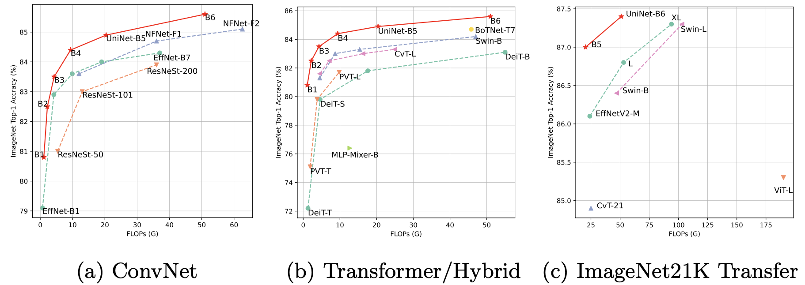

## Pytorch implementation of [UniNet (ECCV 2022)](https://arxiv.org/abs/2207.05420)




This repo is the offcial implementation of the paper [UniNet: Unified Architecture Search with Convolution, Transformer, and MLP](https://arxiv.org/abs/2207.05420)

```
@article{UniNet,
  author  = {Jihao Liu, Xin Huang, Guanglu Song, Yu Liu, Hongsheng Li},
  journal = {arXiv:2207.05420},
  title   = {UniNet: Unified Architecture Search with Convolution, Transformer, and MLP},
  year    = {2022},
}
```

### Update
25/10/2022 Update the source code.

#### Environment
The code is tested with ```torch==1.11``` and ```timm==0.5.4```.


### Run experiments

Currently, we supporting running experiments with slurm.
You can reproduce the results of UniNet-B1 as follows: 

```sh exp/b1/run.sh partition 8```