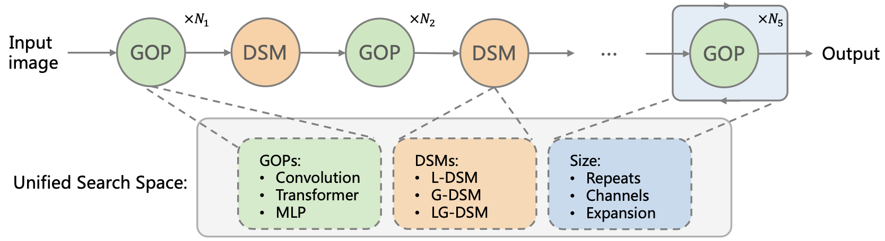

## Pytorch implementation of [UniNet (ECCV 2022)](https://arxiv.org/)




This repo is the offcial implementation of the paper [UniNet: Unified Architecture Search with Convolution, Transformer, and MLP](https://arxiv.org/)

```
@article{UniNet22,
  author  = {Jihao Liu, Xin Huang, Guanglu Song, Yu Liu, Hongsheng Li},
  journal = {arXiv:},
  title   = {UniNet: Unified Architecture Search with Convolution, Transformer, and MLP},
  year    = {2022},
}
```